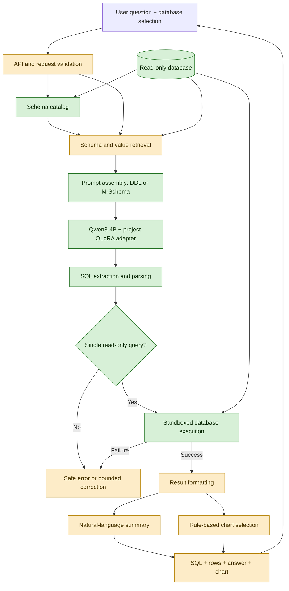
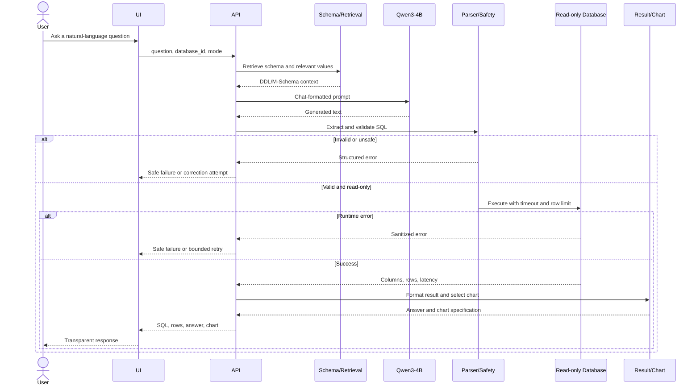
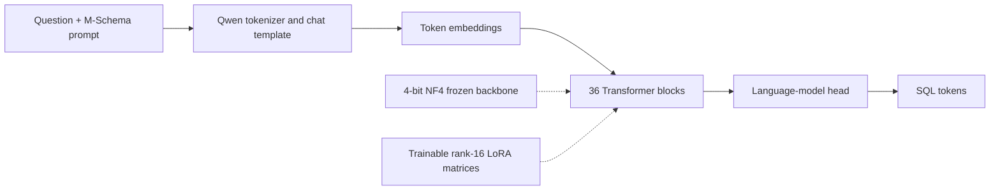

# Milestone 3 Report: Model Architecture and End-to-End System Design

**Talk to Your Database — A Natural-Language Analytics Copilot**

- **Course:** Data Science and AI Lab
- **Milestone:** 3 — Model Architecture
- **Submission date:** July 23, 2026

**Team members**

- Siddhant Hitesh Mantri (21f3002218)
- Anirudh Komanduri (22f1000522)
- Vishal S (23f2003089)
- Walunila Aier (21f3002564)
- Sambhav Jha (22f3003227)
- Smrutishikta Das (21f1006009)

---

## Executive Summary

This project aims to build an open-source analytics copilot that converts a natural-language question into a safe, executable SQL query. The user supplies a question and chooses a database; the system retrieves or serializes the relevant schema, generates SQL, validates it, executes it through a read-only database connection, and returns the SQL and result. The complete product design also includes a natural-language summary and an automatically selected chart.

For Milestone 3, we selected `Qwen/Qwen3-4B-Instruct-2507` as the primary model architecture. It is a modern 4.0B-parameter decoder-only language model that fits our explicit model-size limit of 4B parameters. It produced the strongest zero-shot result among our original general-model candidates and can be fine-tuned on a single Google Colab NVIDIA L4 using QLoRA. Our selected version is the project-trained Qwen3 adapter produced from the natural-distribution Spider training set. With an M-Schema prompt at inference time, it reaches **78.627% strict execution accuracy** and **83.172% MAC-SQL/FINER-compatible execution accuracy** on all 1,034 Spider validation examples.

We also evaluated Qwen2.5-Coder-1.5B, DeepSeek-Coder-1.3B, XiYanSQL-3B, and FINER-SQL-3B. These comparisons justify the Qwen3 selection and reveal useful trade-offs. XiYanSQL is a strong off-the-shelf specialist, while a multi-model execution-consensus system reaches 87.331% benchmark-compatible execution accuracy. However, Qwen3 remains our final primary architecture because it combines strong accuracy, general instruction capability, full ownership of the task-specific training process, and feasible single-GPU deployment. Specialist models and consensus are retained as comparison baselines and optional accuracy extensions.

A consolidated view of what is built, what is designed, and what is future work appears in **Section 2.5**; the annotated architecture diagram in **Section 2.1** marks each component with the same maturity status. The controlled procedure behind every reported comparison is described in the new **Experimental Methodology** section (**Section 5**). The following components are already implemented and experimentally validated:

- Spider data preparation and database-disjoint split preservation;
- DDL, M-Schema, and value-enriched prompt construction;
- sequential model inference on Colab L4;
- QLoRA training with resumable checkpoints;
- SQL extraction and parsing;
- immutable read-only SQLite execution with time and row limits;
- strict and benchmark-compatible execution scoring;
- offline candidate consensus and fallback experiments;
- experiment logging, artifact validation, and automatic Colab shutdown.

The API, UI, retrieval index, result summarization, visualization, and bounded self-correction loop form the next implementation stage. The architecture in this report defines how those modules will connect to the validated model and execution core.

---

## 1. Introduction

### 1.1 Project recap

Relational databases contain valuable information, but querying them normally requires SQL expertise. This prevents many managers, analysts, and domain specialists from directly answering new data questions. Static dashboards help with recurring reports, but they cannot anticipate every question. Our project addresses this gap by allowing a user to ask a question in plain English and receive a transparent database-backed answer.

Text-to-SQL is more difficult than producing syntactically valid SQL. The model must understand the question, identify the correct tables and columns, infer joins, apply filters and aggregations, handle nesting and set operations, and generalize to databases not seen during training. A query can execute successfully while still answering the wrong question. Therefore, our system evaluates semantic result equivalence and not only SQL string similarity.

Milestone 1 defined the core scope as:

- single-database, single-turn questions;
- SQLite initially, with PostgreSQL as a later deployment target;
- read-only SELECT or WITH queries;
- schema-aware SQL generation;
- safe execution with row and time limits;
- SQL and result transparency;
- small open-source models suitable for constrained hardware.

### 1.2 Objectives of Milestone 3

The objectives of this milestone are to:

1. select an appropriate model architecture under the 4B parameter limit;
2. justify the selection through controlled comparisons;
3. define model inputs, outputs, tokenization, and prompt formats;
4. design a feasible training strategy for Google Colab L4;
5. design the complete workflow from user question to final answer;
6. specify module boundaries, safety mechanisms, and integration contracts;
7. establish readiness for model training and subsequent product integration.

Although training is formally associated with Milestone 4, we completed early QLoRA experiments during this milestone to validate that the architecture is computationally feasible and to support the model decision with evidence.

### 1.3 Relationship between model architecture and project goals

The selected architecture directly addresses the project constraints:

| Requirement | Architectural response |
| --- | --- |
| Complex SQL generation | Decoder-only causal language model with strong instruction and code capability |
| Generalization to unseen databases | Question and schema are supplied in every prompt; Spider database-disjoint split is preserved |
| Limited compute | Model size capped at 4B and trained with QLoRA rather than full fine-tuning |
| Database safety | SQL-only prompt, parser validation, immutable connection, SQLite authorizer, timeout, and row cap |
| Semantic correctness | Execution-result equivalence is the primary metric |
| Schema/value grounding | DDL and M-Schema representations; retrieval layer planned for larger databases |
| Reproducibility | Pinned model revisions, checksums, fixed seeds, saved predictions, and resumable checkpoints |
| Interactive use | A single Qwen3 model is the primary path; ensembles remain an optional slower mode |

---

## 2. Overall System Architecture

### 2.1 High-level architecture (annotated by implementation status)

The diagram below is annotated with each component's maturity. Green nodes are **implemented and experimentally validated**, amber nodes are **designed but not yet implemented**, and grey nodes are **future scalability enhancements**. Section 2.5 gives the same classification as a consolidated table.



> **Reading the annotation.** Schema catalog, prompt assembly, the Qwen3 generator, SQL parsing, the read-only safety gate, and sandboxed execution are the validated Milestone 3 core. Request validation/API, retrieval, result formatting, natural-language summary, chart selection, and the bounded-correction branch are designed contracts that connect to that core but are implemented in the next stage. The full FAISS retrieval layer for large schemas (Section 9) is a future scalability enhancement layered onto the `RET` node.

The validated Milestone 3 core covers prompt assembly, model generation, SQL parsing, safety validation, database execution, and evaluation. Retrieval, API integration, natural-language result generation, visualization, and the final UI will be added around this core.

### 2.2 Major modules

| Module | Responsibility | Current status |
| --- | --- | --- |
| Data preparation | Download annotations, inspect SQLite databases, validate gold SQL, and build JSONL | Implemented |
| Schema catalog | Extract tables, columns, types, primary keys, and foreign keys | Implemented |
| Schema representation | Render complete DDL or M-Schema with bounded sample values | Implemented |
| Schema/value retrieval | Select relevant schema and values for large databases | Designed for the application stage |
| Prompt assembly | Combine instruction, schema, question, and optional evidence | Implemented |
| SQL generator | Generate SQL using the selected Qwen3 model and adapter | Implemented |
| SQL parser and safety gate | Extract one query, parse it, and block unsafe operations | Implemented |
| Sandboxed executor | Execute with immutable/read-only access, timeout, and row cap | Implemented |
| Candidate selector | Optionally choose among multiple executable model outputs | Implemented experimentally |
| Self-correction | Regenerate after a parser or execution error | Designed as a bounded extension |
| Result interpretation | Convert database rows into a concise answer using deterministic templates first, with Qwen3 available for complex summaries | Planned |
| Visualization | Select metric, bar, line, or table output | Planned |
| API and UI | Expose the workflow to users | Planned |

### 2.3 Technology stack

| Layer | Technology |
| --- | --- |
| Data and orchestration | Python, JSONL, Parquet, shell scripts |
| Model framework | PyTorch and Hugging Face Transformers |
| Fine-tuning | PEFT, bitsandbytes, Accelerate, QLoRA |
| Parsing | sqlglot |
| Database | SQLite with immutable read-only connections |
| GPU execution | Google Colab CLI with NVIDIA L4 |
| Sampling experiments | vLLM for FINER multi-candidate inference |
| Logging | JSON status files, JSONL predictions, TensorBoard, terminal progress |
| Planned backend | FastAPI |
| Planned retrieval | FAISS with a compact sentence-transformer and lexical value matching |
| Planned frontend | Gradio/Streamlit for the first demo, with React as an optional polished interface |

### 2.4 External services

Hugging Face is used to obtain public, pinned model and dataset revisions. Google Colab supplies the remote L4 GPU. The official Colab CLI allows the local terminal to create a runtime, execute scripts, stream logs, download artifacts, and stop the session. Google Drive is used only for verified cold storage of inactive checkpoints; it is not required for normal training or inference.

### 2.5 Consolidated implementation-status summary

This subsection responds directly to the request to distinguish maturity levels. Every architectural component falls into exactly one of three buckets. This is the authoritative status table for the whole report; the module table in 2.4 and the annotated diagram in 2.1 are consistent with it.

**(i) Implemented and experimentally validated** — code exists, runs end-to-end, and has produced measured results on the 1,034-example Spider validation split:

| Component | Evidence of validation |
| --- | --- |
| Spider data preparation and database-disjoint split | 166 local databases pass SQLite quick checks; zero train/validation database overlap and zero exact (database, question, SQL) overlap |
| Schema catalog + DDL/M-Schema/value-enriched prompt construction | Prompts rendered for all validation examples; longest Qwen sequence 3,173 tokens under the 4,096 limit |
| Sequential Qwen3/Qwen2.5/DeepSeek inference on Colab L4 | Greedy decoding, SDPA, length-batched, automatic OOM batch-halving, one model on GPU at a time with CUDA cache release |
| QLoRA training with resumable checkpoints | Full Qwen3 base run completed 438/438 optimizer steps; final validation loss 0.255960; 33,030,144 trainable parameters; final adapter byte-identical to newest checkpoint |
| SQL extraction, parsing, canonicalization | sqlglot parse/canonical path with single-statement extraction |
| Immutable read-only SQLite execution | `mode=ro&immutable=1`, SQLite authorizer denylist, 3-second timeout, 100,000-row cap, SELECT/WITH-only gate |
| Strict and MAC-SQL/FINER-compatible scoring | Local MAC-SQL implementation cross-checked against the upstream evaluator with zero disagreements on 1,034 predictions |
| Offline candidate consensus and fallback | Execution-signature majority vote with priority-ordered tie-breaking; four- and five-model ensembles measured |
| Experiment logging, artifact validation, auto shutdown | Manifests, checksums, tokenization reports; 32 automated tests covering data, training, evaluation, and analysis |

**(ii) Designed but not yet implemented** — the interface contract and behaviour are specified in this report, but no running code exists yet:

| Component | Specified contract |
| --- | --- |
| FastAPI service (`/health`, `/databases`, `/ask`) | `/ask` accepts question + database ID + mode and returns validated SQL, columns, bounded rows, answer, chart spec, model metadata, latency, warnings |
| Schema/value retrieval selection | Selects relevant tables, columns, keys, and values for databases too large for full-schema prompts |
| Bounded execution-guided self-correction loop | Sends sanitized error + failed SQL back to the model within a fixed retry budget, then repeats every validation step |
| Result interpretation | Deterministic templates first, Qwen3 for complex summaries |
| Rule-based visualization | Chooses metric, bar, line, or table output |
| User interface | Gradio/Streamlit first demo, optional React polish |

**(iii) Future scalability enhancements** — required only when the system moves beyond Spider-scale SQLite; deferred by design:

| Enhancement | Trigger for building it |
| --- | --- |
| FAISS + `bge-small-en-v1.5` retrieval with foreign-key closure | Schemas that no longer fit comfortably in the context window (BIRD, enterprise) |
| BM25 / fuzzy value matching over authorized column values | Large or dirty value spaces where exact matching is insufficient |
| PostgreSQL read-only execution backend | Deployment beyond the initial SQLite target |
| Production serving controls | Concurrency limits, read-only DB pool, request tracing, GPU service more reliable than interactive Colab |
| Independent untouched test set + BIRD benchmark | Final, unbiased accuracy claims |
| In-domain learned candidate selector | Only if it beats execution consensus on in-domain candidates (the public-distribution verifier did not) |

---

## 3. End-to-End Workflow

### 3.1 Complete request sequence



### 3.2 Module inputs and outputs

| Stage | Input | Output |
| --- | --- | --- |
| Request validation | Question, database ID, execution mode | Valid request or typed error |
| Schema/retrieval | Question and authorized database | Selected tables, columns, keys, and values |
| Prompt assembly | Question and schema context | Chat messages |
| Model inference | Tokenized messages | Raw generated text and token counts |
| SQL post-processing | Raw text | Extracted SQL, canonical SQL, syntax status |
| Safety validation | Parsed SQL | Allowed/rejected decision and violation type |
| Execution | Approved SQL and database | Column names, bounded rows, status, and latency |
| Selection | One or more candidate execution results | Chosen SQL and selection reason |
| Presentation | Question, SQL, and result rows | Natural-language answer and chart specification |

### 3.3 Error handling and fallback mechanisms

The architecture uses defense in depth:

- prompts exceeding the configured token limit are rejected rather than silently truncated;
- evaluation batch size is reduced automatically after GPU out-of-memory errors;
- Markdown fences and known reasoning wrappers are removed conservatively;
- missing, unparsable, or multi-statement SQL is not executed;
- SQL must begin with SELECT or WITH;
- SQLite authorizer rules deny mutation, DDL, ATTACH, PRAGMA, and transaction actions;
- the database is opened with `mode=ro&immutable=1`;
- queries are interrupted after three seconds;
- result retrieval stops above 100,000 rows in the evaluator;
- a future correction loop will retry only a bounded number of times;
- if all attempts fail, the user receives an explicit safe failure rather than a fabricated answer.

### 3.4 Storage

Raw data is stored as Parquet, processed examples as JSONL, and databases as SQLite files. Every training package contains a manifest, checksums, and a tokenization report. Model snapshots use Safetensors and include pinned revisions and file hashes. Training runs retain adapter weights, optimizer and scheduler state, RNG state, trainer state, TensorBoard logs, and evaluation metrics. Predictions are stored independently of metrics so they can be rescored without repeating GPU inference.

---

## 4. Model Architecture Selection

### 4.1 Selected model

Our final primary model is `Qwen/Qwen3-4B-Instruct-2507` with the project's natural-distribution Spider QLoRA adapter.

It is a decoder-only causal Transformer. Given instruction, schema, optional values, and question tokens, it generates SQL autoregressively:

$$P(Y \mid X) = \prod_{t=1}^{T} P(y_t \mid X, y_{<t})$$

where $X$ contains the prompt context and $Y$ is the SQL token sequence.

### 4.2 Qwen3 architecture

| Property | Value |
| --- | --- |
| Parameters | 4,022,468,096 |
| Non-embedding parameters reported by model card | Approximately 3.6B |
| Transformer layers | 36 |
| Hidden size | 2,560 |
| Intermediate size | 9,728 |
| Query heads | 32 |
| Key/value heads | 8 |
| Attention | Grouped-query attention |
| Vocabulary size | 151,936 |
| Native context length | 262,144 tokens |
| Project training limit | 4,096 tokens |
| Base inference/training dtype | BF16 computation |
| License reported by model card | Apache-2.0 |

The native context length is much larger than required. We use a 4,096-token training limit because every selected Qwen training sequence fits within it, and attention cost grows quickly with sequence length.

### 4.3 QLoRA architecture



The pretrained backbone is quantized to 4-bit NF4 and frozen. Rank-16 LoRA matrices are added to all linear layers. Only these low-rank parameters are trained. For Qwen3 this results in 33,030,144 trainable parameters, approximately 0.821% of the logical base model.

### 4.4 Comparison models

| Tier | Model | Parameters | Purpose |
| --- | --- | --- | --- |
| Strong/final | Qwen3-4B-Instruct-2507 | 4.022B | Primary project-trained model |
| Compact middle | Qwen2.5-Coder-1.5B-Instruct | 1.544B | Modern code-specialized efficiency baseline |
| Weak/older | DeepSeek-Coder-1.3B-Instruct | 1.346B | Older small-model floor and adaptation control |
| SQL specialist | XiYanSQL-QwenCoder-3B-2504 | 3.086B | Strong off-the-shelf text-to-SQL comparison |
| GRPO specialist | FINER-SQL-3B-Spider | 3.086B | Candidate diversity and test-time scaling comparison |

All models satisfy the 4B limit. The original three general-model revisions and files are pinned locally with SHA-256 checksums.

### 4.5 Inputs and outputs

The model receives a model-native chat prompt containing:

- an instruction to produce one read-only SQLite query;
- the database dialect;
- DDL or M-Schema representation;
- primary and foreign keys;
- up to three bounded representative values per column for M-Schema;
- the natural-language question.

The direct model output is one SQL statement. The surrounding pipeline adds parsed/canonical SQL, execution status, result rows, latency, and safety diagnostics.

---

## 5. Experimental Methodology

This section describes how every reported comparison was produced, so the numbers in Section 6 are reproducible and the comparisons are controlled. Model, prompt, dataset, decoding, hardware, and metric are held fixed except for the single variable under test in each experiment.

### 5.1 Common evaluation dataset

All models are evaluated on the same 1,034-example Spider validation split spanning 20 databases that are unseen during training. The split is database-disjoint: there is zero train/validation database overlap and zero exact (database, question, SQL) overlap. Three non-executable training annotations were excluded during preparation. Difficulty is bucketed with the dataset's simple/moderate/complex proxy (593 / 336 / 105 validation examples) so per-slice accuracy can be reported.

### 5.2 Common prompt protocol

Each model uses its own native tokenizer and chat template. The system instruction is constant: produce one read-only SQLite query, use only the supplied schema, and return SQL only with no Markdown fence or explanation. The user turn carries the dialect, the schema representation, and the question. Schema representation is treated as a *controlled variable*, not a hidden one: the zero-shot baseline uses DDL for all models, and M-Schema is applied per model only where it is measured to help (Qwen3 keeps M-Schema; Qwen2.5 keeps DDL because M-Schema reduced its accuracy). Prompt-format results are therefore reported separately rather than assuming one universal format.

### 5.3 Decoding settings

The default path is deterministic greedy decoding (`do_sample=False`) with a fixed `max_new_tokens` budget and a fixed seed (17). Sampling and temperature are used only for the explicit multi-candidate test-time-scaling ablations (for example FINER multi-sample inference), never for the primary single-model numbers. Attention uses SDPA with a documented fallback to native attention, and computation is BF16.

### 5.4 Training hyperparameters for the QLoRA comparison

The three general models are fine-tuned with an identical QLoRA configuration so the before/after comparison isolates the model, not the recipe: 4-bit NF4 weights, BF16 compute, nested (double) quantization, rank-16 LoRA with alpha 32 and dropout 0.05 on all linear layers, paged AdamW 8-bit, learning rate 2e-4, weight decay 0.0, cosine schedule, warmup ratio 0.03, maximum gradient norm 0.3, one epoch, per-device batch 1 with gradient accumulation 16 (effective batch 16), maximum sequence length 4,096, seed 17, and gradient checkpointing. Loss is assistant-only causal cross-entropy: every system/user/prompt token is masked to `-100` and only the SQL response and its closing chat tokens contribute. The trainer verifies the tokenized prefix is identical across the two render passes and refuses to run rather than silently truncate a schema or target.

### 5.5 Hardware

Every measurement is on a single Colab NVIDIA L4 with approximately 22.03 GiB usable VRAM. Only one model is resident on the GPU at a time; after each model the runner deletes the model and remaining CUDA tensors, runs garbage collection, and empties the allocator before loading the next checkpoint. This keeps peak memory comparable across models rather than confounded by co-residency.

### 5.6 Evaluation protocol

Generated SQL is executed only if it begins with SELECT or WITH. The SQLite connection is opened `mode=ro&immutable=1`, an authorizer denies mutation/DDL/ATTACH/PRAGMA/transaction actions, each query has a 3-second timeout, and result retrieval stops above 100,000 rows. The primary metric is execution-result equivalence, reported two ways: strict (order-preserving) and MAC-SQL/FINER-compatible (one global column permutation, bag semantics on rows). The local MAC-SQL implementation was cross-checked against the upstream evaluator with zero disagreements on 1,034 predictions. Predictions are written to a resumable `predictions.jsonl` and stored independently of `metrics.json`, so any metric correction can be applied by rescoring without rerunning GPU inference. Batching is grouped by prompt length; on out-of-memory the batch size halves and retries without discarding completed predictions.

### 5.7 Statistical comparison

Paired model/prompt/ensemble deltas are tested with the exact McNemar test on the shared 1,034-example set (for example, one M-Schema ensemble improvement is significant at exact McNemar p = 0.000438). Because the same validation split is reused across many decisions, these significance results are treated as development-set evidence, not final test claims (see Section 15.2).

---

## 6. Justification of Model Choice

### 6.1 Controlled zero-shot baseline

All original models were evaluated under the protocol in Section 5: the same 1,034 Spider validation examples, 20 unseen validation databases, prompt format, deterministic generation settings, SQLite executor, and L4 GPU.

| Model | Strict execution accuracy | Syntax valid | Mean generation time/example | Peak allocated VRAM |
| --- | --- | --- | --- | --- |
| Qwen3 4B | 72.340% | 100.000% | 596.252 ms | 9.134 GiB |
| Qwen2.5-Coder 1.5B | 56.576% | 99.903% | 197.728 ms | 4.248 GiB |
| DeepSeek-Coder 1.3B | 47.292% | 98.066% | 817.707 ms | 4.997 GiB |

This established the intended strong, middle, and weak ordering. Qwen3 was 15.764 points above Qwen2.5 and 25.048 points above DeepSeek in strict execution accuracy.

### 6.2 Fine-tuning comparison

The same natural-distribution QLoRA strategy (Section 5.4) was applied to all three general models:

| Model | Before QLoRA | After QLoRA | Improvement |
| --- | --- | --- | --- |
| Qwen3 4B | 72.340% | 76.886% | +4.545 percentage points |
| Qwen2.5-Coder 1.5B | 56.576% | 65.571% | +8.994 points |
| DeepSeek-Coder 1.3B | 47.292% | 67.602% | +20.309 points |

DeepSeek adapts strongly, but Qwen3 still provides the highest general-model result and the strongest capacity ceiling. The comparison also demonstrates that model size and zero-shot rank do not fully predict adaptation efficiency.

### 6.3 Prompt representation

Applying M-Schema to the selected Qwen3 adapter improves strict execution accuracy from 76.886% to 78.627%. Under the MAC-SQL/FINER-compatible metric, it reaches 83.172%. The improvement is especially useful on the complex slice, where M-Schema provides explicit key relations and sample values.

Prompt formats are model-specific. M-Schema severely reduced Qwen2.5 performance, so Qwen2.5 retains DDL. This result justifies keeping prompt assembly separate from the model interface instead of enforcing one universal schema format.

### 6.4 Comparison with SQL specialists and ensembles

| System | Strict EX | MAC-SQL/FINER-compatible EX |
| --- | --- | --- |
| Project-trained Qwen3 4B + M-Schema | 78.627% | 83.172% |
| XiYanSQL 3B + M-Schema | 78.433% | 83.269% |
| FINER-SQL 3B enriched greedy | 76.692% | 81.431% |
| Four-model execution consensus | 82.785% | 87.041% |
| Five-model consensus with FINER | 82.785% | 87.331% |

XiYan is marginally higher under the benchmark-compatible metric, while Qwen3 is slightly higher under the stricter result-order metric. We select Qwen3 because the team owns and understands its complete adaptation pipeline, it is a general model suitable for later correction and result explanation, and it remains nearly tied with the specialist.

The ensemble demonstrates an accuracy ceiling but requires several model generations. It is therefore an optional high-accuracy mode rather than the primary architecture. The exact accuracy sacrificed by choosing a single model is quantified in Section 14.1.

### 6.5 Advantages

- strongest original zero-shot model;
- near-best measured single-model execution performance after QLoRA and M-Schema;
- exactly within the 4B limit;
- compatible with Transformers, PEFT, bitsandbytes, and SDPA;
- complete project-owned training and evaluation pipeline;
- grouped-query attention reduces KV-cache requirements;
- large native context for future wider schemas;
- Apache-2.0 model license reported by the official model card;
- fits inference and QLoRA training on a single L4.

### 6.6 Disadvantages

- slower and larger than 1.3B–1.5B models;
- still weak on multi-join, subquery, and complex semantic construction;
- full-schema prompts can distract the model on large databases;
- one model cannot match the current ensemble's candidate coverage;
- results are based on a repeatedly used validation split, not an untouched final test.

### 6.7 Rejected alternatives

- **Full fine-tuning:** rejected because optimizer, gradient, and parameter memory are impractical on one L4.
- **Models above 4B:** rejected because they violate the explicit size and compute constraint.
- **Current hard-example curriculum:** Qwen3 achieved 74.371%, below the 76.886% natural-distribution adapter.
- **5,000 execution-filtered synthetic examples:** the augmented Qwen3 model achieved 74.468%, indicating negative transfer.
- **Global learned outcome verifier:** the GradeSQL-style Qwen2.5 selector achieved only 78.240% benchmark-compatible EX, below the 87.331% consensus baseline.
- **FINER 30-sample inference as default:** it reached 84.236% benchmark-compatible EX but used much more generation compute and still trailed the ensemble.

---

## 7. Model Inputs and Outputs

### 7.1 Training example format

Each supervised example contains three chat turns:

- **System:** Generate one read-only SQLite query using only the supplied schema.
- **User:** Database dialect + schema + natural-language question.
- **Assistant:** Gold SQL only.

Metadata retains the database ID, database path, schema hash, structural query features, and gold execution-validation result. Structural features such as join count, subquery use, grouping, and complexity are used for analysis and the rejected curriculum ablation; they are not supplied as hidden hand-engineered labels to the generator.

### 7.2 Tokenization and loss masking

Each model uses its native tokenizer and chat template. The trainer first renders the instruction/question prefix and then the complete conversation. It verifies that the full token sequence begins with the same prefix. Every prompt token receives label `-100`; only the assistant SQL and closing assistant tokens contribute to the causal cross-entropy loss.

The trainer does not silently truncate. The longest Qwen sequence is 3,173 tokens under the 4,096-token limit, so no Qwen training example is truncated.

### 7.3 Inference outputs

For every example the evaluator stores:

- raw response;
- extracted SQL;
- normalized and canonical SQL;
- syntax and format status;
- execution result and error category;
- strict and benchmark-compatible correctness;
- prompt and generation token counts;
- generation latency and GPU memory;
- model revision, adapter, prompt variant, and decode settings.

This separation allows outputs to be rescored when an evaluator is corrected without rerunning GPU inference.

---

## 8. Training Strategy

### 8.1 Dataset

The training source is Spider 1.0 paired with the local SQLite database collection.

| Split | Source examples | Usable examples | Databases | Simple | Moderate | Complex |
| --- | --- | --- | --- | --- | --- | --- |
| Train | 7,000 | 6,997 | 140 | 3,995 | 2,242 | 760 |
| Validation | 1,034 | 1,034 | 20 | 593 | 336 | 105 |

All 166 local databases pass SQLite quick checks. There is zero train/validation database overlap and zero exact (database, question, SQL) overlap. Three non-executable training annotations were excluded. The validation databases remain unseen during training.

### 8.2 Selected QLoRA configuration

| Hyperparameter | Value |
| --- | --- |
| Backbone | Qwen3-4B-Instruct-2507 |
| Base revision | cdbee75f17c01a7cc42f958dc650907174af0554 |
| Quantization | 4-bit NF4 |
| Compute dtype | BF16 |
| Double quantization | Enabled |
| LoRA rank | 16 |
| LoRA alpha | 32 |
| LoRA dropout | 0.05 |
| Target modules | All linear layers |
| Loss | Assistant-only causal cross-entropy |
| Optimizer | Paged AdamW 8-bit |
| Learning rate | 2e-4 |
| Weight decay | 0.0 |
| Scheduler | Cosine |
| Warmup ratio | 0.03 |
| Maximum gradient norm | 0.3 |
| Epochs | 1 |
| Per-device batch | 1 |
| Gradient accumulation | 16 |
| Effective batch | 16 |
| Maximum sequence length | 4,096 |
| Seed | 17 |
| Gradient checkpointing | Enabled |

### 8.3 Checkpointing and recovery

Complete checkpoints are saved every 100 optimizer steps and at the final step. Each contains adapter, optimizer, scheduler, RNG, and trainer state. The remote job creates a checksum-protected archive, while a local monitor downloads and validates completed checkpoints during training. If Colab deletes the runtime, a new L4 can resume from the latest verified local checkpoint.

The full Qwen3 base run required several runtime resumptions but completed all 438 optimizer steps. The final validation loss was 0.255960, peak allocated VRAM was 10.638 GiB, and the final adapter contains 33,030,144 trainable parameters. The final adapter matches the newest checkpoint byte for byte.

### 8.4 Early stopping

Early stopping is not used for the one-epoch selected run. Validation loss is treated as diagnostic rather than the primary selection metric because lower token loss does not always imply higher execution accuracy. Longer future runs will use an independent development subset for early stopping and preserve a separate untouched test set.

---

## 9. Model Pipeline

### 9.1 Preprocessing

1. Resolve the selected database through an allow-listed database ID.
2. Inspect tables, columns, types, and key relations.
3. Render complete M-Schema for the current Spider-scale databases.
4. Add the natural-language question and SQL-only instruction.
5. Apply the Qwen chat template and count tokens.
6. Refuse inference if required context would be truncated.

### 9.2 Generation

The default Qwen3 path uses deterministic greedy generation, BF16 weights, and SDPA attention. Evaluation uses batches grouped by prompt length. Only one model is loaded on the GPU at a time; objects and CUDA cache are released before another model is loaded.

### 9.3 Post-processing

The raw response is converted into a safe candidate by:

1. removing a known reasoning suffix/prefix when applicable;
2. extracting SQL from an optional Markdown fence;
3. locating the first SELECT or WITH;
4. keeping one statement;
5. parsing and canonicalizing with sqlglot;
6. applying the read-only gate;
7. executing in the sandbox.

No automatic semantic repair is applied silently. A later correction loop will send a sanitized error and failed SQL back to the model, then repeat every validation step.

### 9.4 Final prediction

The selected SQL and execution result are returned to the presentation layer. The planned API will add a short answer and chart specification. Successful execution alone will not be presented as certainty; the SQL remains visible so a user can inspect it.

---

## 10. Retrieval and Knowledge Components

The current Spider implementation supplies the complete database schema, so it does not require a vector database. M-Schema already provides structured grounding through table names, columns, types, keys, foreign keys, and bounded representative values.

For larger BIRD or enterprise schemas, the architecture will add a retrieval layer:

1. create one schema chunk per table, including columns and key relationships;
2. embed schema chunks with a compact sentence-transformer;
3. store normalized embeddings in FAISS and retrieve using cosine similarity;
4. use exact/fuzzy or BM25 matching over authorized column values;
5. add foreign-key path tables needed to connect retrieved entities;
6. rerank and serialize the final context as M-Schema;
7. preserve table/column provenance for debugging.

The initial planned embedding model is `BAAI/bge-small-en-v1.5`, chosen for its compact size, while FAISS avoids running a separate database service. Retrieval will be evaluated using gold-table recall, gold-column recall, prompt-token reduction, execution accuracy, and latency. Full schema remains the fallback when the schema fits comfortably in the context window.

No unstructured-document RAG is required for the current core task. Retrieval is over database schema and authorized values, not general web knowledge.

---

## 11. Prompt Engineering

### 11.1 Base prompt

```
You convert natural-language questions into one read-only SQLite query.
Use only the supplied database schema. Return SQL only, with no Markdown
fence, explanation, or alternative query.

Database dialect: SQLite
Database schema:
{SCHEMA}
Question: {QUESTION}
```

### 11.2 Selected M-Schema prompt

The final Qwen3 input uses the XiYan-style English M-Schema representation. It lists each table, typed columns, primary keys, representative values, and foreign-key relationships, followed by the user question and optional evidence. This representation improved Qwen3 execution accuracy without changing the adapter.

### 11.3 Strategy

The selected primary path uses a supervised adapter and greedy decoding rather than few-shot examples. Few-shot demonstrations consume context and may introduce leakage if selected incorrectly. They remain a future ablation using training databases only.

The output format is SQL only. JSON wrapping occurs after validation and execution in the API layer. Hallucination is mitigated through exact schema context, value grounding, parser validation, immutable execution, and explicit failure handling. Instructions contained inside database values will be treated as untrusted data.

---

## 12. System Integration

### 12.1 Shared candidate schema

Every generator returns a standard internal record containing:

- request/example ID;
- model and adapter revision;
- prompt variant;
- raw text and extracted SQL;
- syntax and safety status;
- execution status, rows signature, and latency;
- selection metadata.

This allows Qwen3 to be replaced or supplemented without changing the parser, executor, or presentation layer.

### 12.2 Proposed API

The FastAPI service will expose:

- `GET /health` — model and database health;
- `GET /databases` — authorized database list;
- `POST /ask` — complete natural-language-to-answer workflow.

`POST /ask` accepts a question, database ID, and mode. It returns the validated SQL, columns, bounded rows, natural-language answer, chart specification, model metadata, latency, and warnings. Users will never supply raw database paths or credentials.

### 12.3 Orchestration

The system does not currently require LangChain, LangGraph, or CrewAI. The core is a deterministic workflow with explicit Python functions, which is easier to test and secure. A model-driven agent is unnecessary for schema lookup, parsing, safety checks, or execution.

No model-native function calling is used in the current core. Schema lookup and read-only SQL execution are deterministic application tools controlled by the orchestrator. A future correction loop may expose only a narrowly scoped read-only execution tool with a fixed retry budget.

The Colab workflow validates inputs, provisions an L4, installs pinned dependencies, uploads code/data, runs training or evaluation, streams progress, downloads results, verifies artifacts, and stops the session. Automatic shutdown is used in success and most failure paths to avoid wasting compute.

---

## 13. Computational Requirements

### 13.1 Hardware

The validated environment is one NVIDIA L4 with approximately 22.03 GiB usable VRAM. Qwen3 baseline inference peaks at 9.134 GiB allocated VRAM. QLoRA training peaks at 10.638 GiB allocated VRAM, demonstrating comfortable feasibility on the L4.

### 13.2 Latency

Recorded batched L4 generation averages are:

| Model/path | Mean generation time per example |
| --- | --- |
| Qwen2.5 1.5B baseline | 197.728 ms |
| XiYanSQL 3B M-Schema | 465.593 ms |
| Qwen3 4B baseline DDL | 596.252 ms |
| Qwen3 4B adapter M-Schema | 1,169.046 ms |
| FINER 3B enriched greedy | 2,202.896 ms |

These are offline batch averages, not final API latency. Deployment testing will measure batch-size-one cold and warm p50/p95 latency including retrieval and execution.

### 13.3 Storage

The three original model snapshots occupy approximately 12.9 GB decimal in total. The complete current `models/` directory is about 13 GiB. Datasets and processed data use about 296 MiB, while experiment artifacts use several GiB because checkpoints include optimizer state. Old inactive QLoRA runs have been checksum-verified and moved to Google Drive cold storage, while reusable base weights and selected adapters remain local.

### 13.4 Scalability

A single Qwen3 worker can serve the primary path on one 12–24 GB GPU. Accuracy-mode ensembles multiply generation cost and should be reserved for offline or high-value requests. Retrieval and schema caching will control prompt growth. Production deployment will require concurrency limits, a read-only database pool, request tracing, and a GPU service more reliable than an interactive Colab runtime.

---

## 14. Design Decisions and Trade-offs

Every choice below is stated as an explicit trade: what the selected design gives up, and what it buys in return. The dominant sacrifice is single-model simplicity in exchange for measurable peak accuracy.

### 14.1 Single model versus ensemble (accuracy sacrificed for simplicity and latency)

Choosing one Qwen3 model instead of the multi-model execution consensus sacrifices roughly **4.16 percentage points of strict EX** (78.627% → 82.785%) and **4.16 points of MAC-SQL EX** (83.172% → 87.331%). In return, the primary path runs **one** model generation instead of four or five, loads one adapter, has simpler and more debuggable failure modes, and reuses a general instruction model for the planned correction and summarization stages. The ensemble's higher ceiling is real but costs a multiple of the generation compute per query, which is unacceptable for interactive use. Consensus is therefore retained only as an optional offline/high-value accuracy mode, not the default.

### 14.2 Deterministic greedy versus test-time scaling (peak accuracy sacrificed for reproducibility and compute)

Greedy decoding gives up the gains available from sampling-based candidate expansion — FINER 30-sample inference reached 84.236% MAC-SQL EX — in exchange for reproducible outputs and roughly single-pass generation cost. A learned global verifier was also tried to recover ensemble-level accuracy cheaply, but the GradeSQL-style selector reached only 78.240% MAC-SQL EX, below plain consensus, so the added machinery did not justify its cost. The design keeps deterministic greedy as the default and treats sampling as an explicit, opt-in accuracy experiment.

### 14.3 Per-model prompt format versus one universal format (interface simplicity sacrificed for accuracy)

M-Schema raises Qwen3 strict EX by 1.741 points (76.886% → 78.627%) but *lowers* Qwen2.5 accuracy. Rather than force one schema format everywhere, the design sacrifices a single universal prompt and keeps prompt assembly a per-model concern. This adds interface complexity but avoids leaving accuracy on the table for the model we actually ship.

### 14.4 Natural-distribution data versus engineered curricula (potential hard-example gains sacrificed to avoid regressions)

Both the hard-example curriculum (74.371%) and 5,000 execution-filtered synthetic examples (74.468%) underperformed the natural-distribution adapter (76.886%) — negative transfer. The design gives up the hoped-for hard-example benefit in exchange for not regressing the shipped model, and records these as rejected ablations rather than silently discarding them.

### 14.5 Accuracy versus speed

Qwen2.5 is faster but materially less accurate. XiYan is an efficient specialist, while Qwen3 provides a project-owned model with nearly identical single-model performance and greater general flexibility. We choose Qwen3 as the primary architecture and treat consensus as an optional accuracy mode.

### 14.6 Model size versus capacity

Models below 2B train efficiently and improve substantially, but they remain behind Qwen3 on absolute accuracy. Models above 4B may offer greater capacity but violate the project constraint. Qwen3 occupies the available upper boundary and is the best capacity/feasibility compromise.

### 14.7 Full schema versus retrieval

Complete M-Schema maximizes recall for small databases but grows with schema size. Retrieval reduces prompt length but can omit a required table or column. The system will use complete schema when it fits and retrieval with foreign-key closure for larger databases.

### 14.8 Cloud versus local execution

The local Mac is suitable for preprocessing, scoring, and orchestration but not efficient BF16 GPU work. Colab L4 makes training practical, although runtimes can disappear and quotas vary. Incremental verified checkpoints and automatic cleanup mitigate this limitation. Colab remains a development platform, not the final production host.

### 14.9 Metric trade-off

The strict project metric preserves result column order. The MAC-SQL/FINER-compatible metric permits a global column permutation and follows the semantics used by published FINER results. The local implementation was cross-checked against the upstream evaluator with zero disagreements on 1,034 selected predictions. Both metrics are reported because they answer different questions. Neither result is Spider hidden-test or test-suite accuracy, and execution on one database instance can accept accidental equivalence.

---

## 15. Risks and Limitations

### 15.1 Model limitations

The largest remaining errors are semantic rather than syntactic. Baseline Qwen3 reaches 82.12% strict execution accuracy on simple queries but only 61.91% on moderate and 50.48% on complex queries. Multi-join and join-plus-subquery cases are especially difficult. Common failures include invented columns, missing joins, incorrect aggregation, and executable queries that answer the wrong question.

### 15.2 Validation overfitting

The Spider validation set has been used for model, prompt, curriculum, and ensemble decisions. It must therefore be treated as a development set rather than an unbiased final test. Final claims will require a frozen configuration and evaluation on an untouched database-disjoint set. BIRD remains a planned broader benchmark because it contains larger, noisier databases and evidence-dependent questions.

### 15.3 Safety and privacy

Read-only SQLite execution prevents database modification but does not establish production authorization. A deployed system also needs authentication, allow-listed databases, table/column permissions, secrets management, audit logs, rate limits, and privacy controls. Representative values in M-Schema must be generated only from data the requesting user is authorized to view.

### 15.4 Hallucination and ambiguity

Successful execution is not proof of correctness. Ambiguous questions may have several reasonable interpretations. The product will show generated SQL and use explicit clarification or safe failure instead of silently choosing an unsupported interpretation.

### 15.5 Dataset and generalization limitations

Spider is English and relatively clean. It does not fully represent enterprise schemas, dirty values, business documentation, multilingual users, or multiple SQL dialects. Results cannot be assumed to transfer directly to PostgreSQL, BIRD, or private organizational databases.

### 15.6 Infrastructure limitations

Colab runtimes may reset, package versions may conflict, and simultaneous GPU allocation is not guaranteed. Checkpoint recovery prevents experiment loss but does not remove replay time. Model and dataset licenses must also be reviewed before public redistribution of weights or derived artifacts.

### 15.7 Architectural risks and mitigation strategies

The risks above are largely about the trained model and the data. This subsection isolates the *architectural* risks — properties of the system design rather than the checkpoint — and the concrete mitigation each one already has or is designed to have.

| Architectural risk | Why it threatens the design | Mitigation (status) |
| --- | --- | --- |
| **Larger schemas** exceed the context window or dilute attention | Full M-Schema grows with table/column count; the 4,096-token training limit and model focus both degrade on very large databases | Refuse-rather-than-truncate gate is **implemented**; FAISS + foreign-key-closure retrieval with full-schema fallback and a prompt-token-reduction metric is **designed** (Sections 10, 16) |
| **Ambiguous queries** have several valid interpretations | An executable query can silently answer the wrong question; column-order and DISTINCT ambiguity inflate or deflate apparent accuracy | SQL is always shown to the user (**implemented**); planned clarification / explicit safe-failure instead of silent guessing (**designed**); dual strict-vs-MAC-SQL metric surfaces column-order ambiguity (**implemented**) |
| **Unsupported or malformed SQL constructs** | The model may emit multi-statement output, non-parsable SQL, or dialect-specific constructs (e.g. PostgreSQL-only syntax) that SQLite cannot run | sqlglot parse + canonicalization, single-statement extraction, and the SELECT/WITH-only read-only gate reject these before execution (**implemented**); sanitized error is surfaced (**implemented**); a bounded correction loop will re-generate from the parser/execution error (**designed**); dialect-aware parsing is added with the PostgreSQL backend (**future**) |
| **Future scalability** of an interactive-Colab, single-worker core | Colab is not a production host; ensembles multiply cost; concurrency and durability are unaddressed | Deterministic Python core with no agent framework keeps the hot path testable (**implemented**); single Qwen3 worker on a 12–24 GB GPU serves the primary path with ensembles reserved for offline/high-value requests (**implemented/experimental**); concurrency limits, read-only DB pool, request tracing, and a reliable GPU service are **future** enhancements (Section 13.4) |

---

## 16. Generalizability Beyond Spider

This section addresses how far the *architecture* transfers beyond the Spider benchmark, and separates the components that stay the same from those that must change for BIRD, PostgreSQL, or enterprise databases. The short answer: the model interface, prompt-assembly abstraction, safety-gate concept, candidate record, and evaluation harness are benchmark-independent; the schema-serialization, execution backend, value grounding, dialect handling, training data, and metrics are benchmark-specific.

### 16.1 Components that remain unchanged

These are invariant across databases because they depend on contracts, not on Spider itself:

- **Generator + QLoRA adapter interface.** The decoder-only model and the adapter loading/verification contract are unchanged; moving benchmarks means retraining the adapter on new data, not rewiring the interface.
- **Prompt-assembly abstraction.** The DDL/M-Schema renderers and the "prompt is a per-model concern" boundary already isolate format from model, so a new serialization plugs into the same slot.
- **SQL extraction, parsing, and canonicalization.** sqlglot is dialect-configurable, so the extract → single-statement → canonicalize path stays; only the dialect argument changes.
- **Safety-gate model.** The "single, read-only, allow-listed" gate concept transfers directly; the read-only-first, sanitized-error, no-silent-repair behaviour is engine-independent.
- **Shared candidate record and module contracts.** The internal record (Section 12.1) lets the generator, selector, executor, and presentation layer stay decoupled regardless of database.
- **Evaluation harness.** Execution-result equivalence is the metric family everywhere; the harness is parameterized by database engine and metric, and predictions are stored separately from metrics for rescoring.
- **Experiment logging and checkpoint recovery.** Manifests, checksums, resumable checkpoints, and automatic shutdown are orthogonal to the benchmark.

### 16.2 Components that require modification

These carry Spider/SQLite-specific assumptions and must be adapted:

- **Schema serialization.** Spider databases fit in a full-schema prompt; enterprise schemas do not. The designed retrieval layer (FAISS + FK closure) becomes load-bearing rather than optional, and full-schema fallback stops applying.
- **Execution backend.** The immutable SQLite connection must become a PostgreSQL read-only connection pool with role-scoped permissions, a server-side statement timeout, and read-only transactions. The SQLite authorizer denylist has no direct PostgreSQL equivalent and is replaced by database roles and grants.
- **Value grounding.** BIRD adds evidence/external-knowledge handling and dirtier values; representative-value sampling must respect per-user authorization, which Spider does not exercise.
- **SQL dialect.** sqlglot's read/write dialect must switch, and SQLite-specific assumptions (for example type affinity and permissive typing) must be revisited for stricter engines.
- **Training data.** Spider is clean, English, and single-dialect. BIRD and enterprise data are noisier, evidence-dependent, and possibly multilingual, so the adapter must be re-tuned on representative data rather than reused as-is.
- **Metrics.** Strict and MAC-SQL EX are Spider-oriented. BIRD uses its own execution accuracy and an optional efficiency metric (VES); stronger guarantees need test-suite accuracy on an untouched, database-disjoint set.
- **Retrieval evaluation.** Gold-table recall, gold-column recall, and prompt-token reduction move from "planned diagnostics" to primary metrics once schemas are large enough that retrieval, not the model, becomes the accuracy bottleneck.

---

## 17. Deliverables Produced

The milestone produced:

- selected Qwen3-4B model architecture and pinned revision;
- complete end-to-end architecture and sequence diagrams;
- processed Spider train/validation datasets and EDA;
- DDL, M-Schema, FINER, synthetic, and ORM data packages;
- tokenizer-length and leakage audits;
- three controlled general-model baselines;
- QLoRA configurations and validated adapters;
- specialist-model and ensemble comparisons;
- SQL extraction, parsing, and immutable execution pipeline;
- strict and MAC-SQL-compatible evaluation tools;
- error analysis and paired significance comparisons;
- Colab CLI setup, monitoring, checkpoint recovery, artifact collection, and shutdown scripts;
- experiment manifests, checksums, predictions, logs, and metrics;
- 32 automated tests covering data, training, evaluation, and analysis behavior.

The repository is organized into `configs/`, `data/`, `models/`, `src/`, `scripts/`, `tests/`, `artifacts/`, `docs/`, and `milestone3/`. The experiment history and exact evidence paths are recorded in `docs/project-experiment-ledger.md`.

---

## 18. Summary and Next Steps

We selected a project-trained Qwen3-4B-Instruct-2507 QLoRA model as the primary architecture for the natural-language-to-SQL module. It satisfies the 4B constraint, fits on one Colab L4, provides the strongest original zero-shot performance, and reaches 78.627% strict and 83.172% benchmark-compatible execution accuracy with M-Schema. Smaller models remain useful efficiency baselines, while SQL specialists and execution consensus define optional higher-accuracy extensions.

The validated core workflow is:

```
question + schema
  -> M-Schema prompt
  -> Qwen3-4B + LoRA adapter
  -> SQL extraction and parsing
  -> read-only safety validation
  -> sandboxed execution
  -> SQL and result rows
```

The immediate next steps are:

1. freeze the selected Qwen3 revision, adapter, prompt, and evaluation settings;
2. build the FastAPI `/ask` path around the existing model and executor;
3. implement table-level schema retrieval and value grounding for large schemas;
4. add a bounded execution-guided correction loop;
5. add result summarization and rule-based chart selection;
6. build a minimal UI that displays SQL, rows, answer, chart, and errors;
7. evaluate once on an untouched database-disjoint set and add BIRD if feasible;
8. measure batch-size-one end-to-end latency and safety behavior;
9. train any future selector on in-domain candidates rather than relying on the rejected public-distribution verifier.

The architecture is ready for Milestone 4 training and product integration. The primary technical challenge is no longer fitting or training a small model; it is improving schema grounding and candidate selection without overfitting the existing Spider validation set.

---

## References

1. Yu, T. et al. "Spider: A Large-Scale Human-Labeled Dataset for Complex and Cross-Domain Semantic Parsing and Text-to-SQL Task." EMNLP 2018. https://aclanthology.org/D18-1425/
2. Official Spider repository. https://github.com/taoyds/spider
3. Qwen3-4B-Instruct-2507 model card. https://huggingface.co/Qwen/Qwen3-4B-Instruct-2507
4. Qwen2.5-Coder-1.5B-Instruct model card. https://huggingface.co/Qwen/Qwen2.5-Coder-1.5B-Instruct
5. DeepSeek-Coder-1.3B-Instruct model card. https://huggingface.co/deepseek-ai/deepseek-coder-1.3b-instruct
6. XiYanSQL-QwenCoder-3B-2504 model card. https://huggingface.co/XGenerationLab/XiYanSQL-QwenCoder-3B-2504
7. XGenerationLab M-Schema. https://github.com/XGenerationLab/M-Schema
8. FINER-SQL repository. https://github.com/thanhdath/finer-sql
9. GradeSQL repository. https://github.com/sisinflab/GradeSQL
10. Dettmers, T. et al. "QLoRA: Efficient Finetuning of Quantized LLMs." https://arxiv.org/abs/2305.14314
11. Hugging Face Transformers bitsandbytes documentation. https://huggingface.co/docs/transformers/quantization/bitsandbytes
12. Hugging Face PEFT LoRA documentation. https://huggingface.co/docs/peft/en/package_reference/lora
13. Google Developers Blog. "Introducing the Google Colab CLI." June 5, 2026. https://developers.googleblog.com/introducing-the-google-colab-cli/
14. BAAI bge-small-en-v1.5 model card. https://huggingface.co/BAAI/bge-small-en-v1.5

---

**SIGNATURE OF APPROVAL**

- Siddhant Hitesh Mantri
- Anirudh Komanduri
- Vishal S
- Walunila Aier
- Sambhav Jha
- Smrutishikta Das
