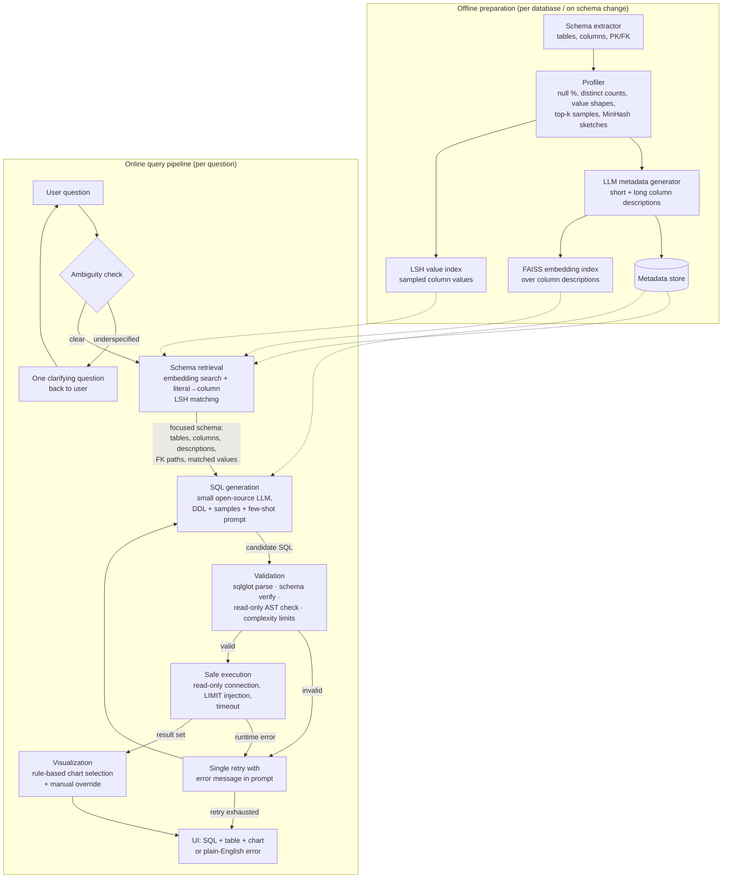

# Milestone 1 (Revised): Problem Definition and Literature Review

Project: Talk to Your Database - A Natural-Language Analytics Copilot

Course: Data Science and AI Lab

Team Members:

- Siddhant Hitesh Mantri (21f3002218)
- Anirudh Komanduri (22f1000522)
- Vishal S (23f2003089)
- Smrutishikta Das (21f1006009)
- Walunila Aier (21f3002564)
- Sambhav Jha (22f3003227)

## 1. Problem Definition

Relational databases contain much of an organization's useful data, but querying them usually requires SQL knowledge. This blocks non-technical users such as managers, operations teams, product teams, and domain experts from directly answering data questions. Our project addresses this by building a natural-language analytics copilot: a user asks a question in plain English, the system identifies relevant schema context, generates a read-only SQL query, executes it safely, and returns the result as a table and, when appropriate, a visualization.

**Motivating use cases.** Four concrete scenarios represent the target user:

1. **E-commerce category manager (ad-hoc diagnosis).** "Which products had the highest return rate last quarter, and from which cities?" Today this requires filing a ticket with the analytics team and waiting one to three days. Our system answers in seconds by joining `orders`, `returns`, `products`, and `customers`, rendering a bar chart, and showing the SQL for verification.
2. **Customer support lead (operational triage).** "How many orders placed in the last 30 days are still unshipped, grouped by payment method?" No dashboard covers this exact slice; the copilot generates the query on demand, enforces read-only execution, and returns a table the lead can act on immediately — instead of exporting three CSVs and pivoting them in a spreadsheet.
3. **Finance/revenue operations (trend monitoring).** "Show month-over-month revenue growth by region for the last six months." This requires a date-truncated aggregation with a period-over-period comparison — routine for an analyst, impossible for a finance associate without SQL. The system returns a line chart with the underlying numbers, and the manual chart override lets the user switch to a table for reporting.
4. **Inventory planner (threshold query with ambiguity).** "Which fast-moving products are low on stock?" is underspecified — what counts as fast-moving or low? This exercises our clarification turn (Section 6.1): the system asks one question ("Define fast-moving as top 20% by units sold last month, and low stock as below 50 units?") and then answers, stating its assumptions above the result.

Together these cover the four behaviors the system must get right: multi-table joins, filtered aggregation, temporal analytics with appropriate charting, and graceful handling of ambiguous intent.

The problem is not only SQL generation. A usable system must handle the full workflow: understand the question, retrieve relevant tables and columns, generate valid SQL, execute it safely, and present the answer in a form users can inspect. Based on TA feedback, we narrow the required scope to the core workflow: natural language to SQL generation, schema-aware retrieval, SQL execution, and automatic visualization. Agentic self-correction beyond a single retry, full multi-turn conversation memory, multi-model comparison, and broad benchmarking remain stretch goals.

## 2. Stakeholders and Scope

Primary stakeholders are non-technical business users and domain experts who need database answers without writing SQL. Secondary stakeholders include analysts, data engineers, database administrators, and course evaluators.

In scope:

- Single-database querying using SQLite or PostgreSQL.
- Single-turn natural-language analytical questions, plus **limited-scope clarification turns**: when the system detects an ambiguous or underspecified question (Section 6.1), it asks exactly one clarifying question and uses the answer to regenerate SQL. This is bounded clarification, not full conversation memory.
- Read-only `SELECT` queries.
- Schema-aware retrieval over tables, columns, keys, and sampled values (Section 7).
- SQL generation using feasible small open-source models (rationale in Section 8.1).
- SQL validation, hallucination checks, row limits, timeouts, and read-only execution (Section 9).
- Result display as SQL, table, and automatic chart with a manual chart-type override (Section 10).
- Evaluation against quantitative acceptance targets (Section 11).

Out of scope for the core deliverable:

- Write operations such as `INSERT`, `UPDATE`, `DELETE`, `DROP`, or `ALTER`.
- Multi-database federation.
- Production-grade enterprise access control beyond read-only sandboxing.
- Training a model from scratch.
- Full multi-turn conversation memory beyond the single clarification turn.
- Large-scale model comparison or exhaustive benchmarking.

Stretch goals prioritize execution-guided self-correction (multiple retries) and full multi-turn follow-up questions. Extra model baselines and broader Spider/BIRD evaluation will be attempted only if time permits.

## 3. Why the Problem Matters

In many organizations, users depend on dashboards, analysts, or spreadsheet exports. Dashboards work for repeated metrics but cannot cover every new question. Analysts can write custom SQL, but this creates delay and repeated manual work. A natural-language database interface can reduce this friction while still showing SQL for transparency.

The problem is technically important because realistic text-to-SQL is still unsolved. Real databases contain many tables, unclear column names, foreign-key relationships, dirty values, domain-specific terminology, and ambiguous questions. Benchmarks such as BIRD and Spider 2.0 were introduced because older datasets often understate these real-world difficulties. Notably, industrial experience reported by AT&T researchers indicates that the hardest part of query writing is *understanding database contents* — undocumented join paths, ambiguous columns, and inconsistent value formats — rather than SQL syntax itself (Shkapenyuk et al., 2025). This directly shapes our design: we invest in metadata quality and retrieval, not just generation.

## 4. Current Approaches and Literature Review

### 4.1 Existing tooling and commercial context

Organizations currently address database access through BI tools such as Tableau, Power BI, Looker, Metabase, and Superset, plus SQL notebooks and analyst-mediated workflows. These tools are useful, but someone still has to define SQL, joins, dashboards, or metrics in advance. General-purpose LLMs can draft SQL, but they are brittle without accurate schema context, table relationships, value examples, and database constraints.

### 4.2 Comparison against open-source Text-to-SQL frameworks

Per reviewer feedback, we position our system against three widely used open-source frameworks:

| Framework | Approach | What it lacks for our use case |
|---|---|---|
| **LangChain SQL agent / chain** | Injects full schema (`CREATE TABLE` DDL + sample rows) into an agent loop; retries on error | No dedicated schema-linking module for large schemas; no value/literal grounding; agent loops add latency and unpredictability; designed around large hosted LLMs |
| **LlamaIndex `NLSQLTableQueryEngine` / `SQLTableRetrieverQueryEngine`** | Embedding-based table retrieval, then SQL generation | Retrieval is table-level only (no column/value grounding); no profiling-derived metadata; visualization not integrated |
| **Vanna.ai** | RAG over user-supplied DDL, documentation, and past question–SQL pairs | Quality depends on hand-curated training pairs the user must supply; no automatic metadata extraction; safety checks minimal |

Our contribution relative to these: (a) **automatic metadata generation via profiling** rather than hand-written documentation, (b) **value-level grounding** using MinHash/LSH indices to map question literals to columns, (c) a **defense-in-depth validation layer** with defined failure paths, and (d) an integrated visualization module — all sized for small open-source models rather than frontier APIs.

### 4.3 Research literature and how each work informs a design decision

Early systems such as Seq2SQL and SQLNet showed that neural models could generate executable SQL at scale on WikiSQL (Zhong et al., 2017; Xu et al., 2017), but WikiSQL is mostly single-table. → *Design consequence: we target multi-table schemas from the start.*

Spider established cross-domain evaluation with 10,181 questions over 200 databases (Yu et al., 2018) and shifted attention to **schema linking**. RAT-SQL uses relation-aware schema encoding (Wang et al., 2020), and RESDSQL decouples schema linking from SQL skeleton generation (Li et al., 2023a). → *Design consequence: schema retrieval is an explicit, separately evaluable module in our pipeline, not an implicit part of the prompt.*

Execution-guided decoding prunes candidates using database feedback (Wang et al., 2018), and PICARD constrains decoding via incremental parsing (Scholak et al., 2021). → *Design consequence: our validation layer parses generated SQL with `sqlglot` and verifies every referenced identifier against the schema before execution — a lightweight, decoding-agnostic analogue of PICARD's guarantee.*

LLM-era work shows prompt and schema formatting materially affect accuracy: `CREATE TABLE` DDL plus a few sample rows outperforms plain-text schema listings (Rajkumar et al., 2022; Nan et al., 2023). DIN-SQL adds decomposition and self-correction (Pourreza and Rafiei, 2023). → *Design consequence: our prompt format follows Rajkumar/Nan (Section 8.2); we adopt a single-retry correction loop rather than DIN-SQL's full decomposition, trading a few accuracy points for latency and simplicity.*

**Metadata-centric and ensemble approaches now dominate the BIRD leaderboard**, and each contributes a distinctive mechanism worth naming precisely:

- **Automatic metadata extraction (Shkapenyuk et al., 2025 — AT&T, BIRD #1 without human hints).** Database **profiling** computes per-column statistics (null counts, distinct counts, value shapes, top-k values) plus **MinHash sketches**, whose pairwise resemblance reveals cross-column value overlap — surfacing undocumented join paths (25% of joins used in BIRD gold SQL are absent from the schema). Profiles feed one LLM call per column producing **human-readable short/long column descriptions**; strikingly, this machine-generated metadata *outperformed BIRD's human-written metadata* (61.2% vs 59.6% EX). **LSH indices over sampled column values** match question literals to the columns that actually contain them. Their schema linker is also unusual: instead of asking an LLM "which columns are relevant" (a task LLMs answer poorly), it **harvests referenced fields from SQL generated under several metadata variants** — aligning the linking task with the generation task. Few-shot examples are retrieved by embedding the question with **literals masked out**, so retrieval matches query *structure* rather than surface values.
- **CHESS (Talaei et al., 2024).** A pipeline of specialized agents: LSH-based keyword/entity retrieval over values, vector retrieval over column descriptions, then **LLM-driven hierarchical pruning** (table-level, then column-level) to shrink hundred-table schemas into a minimal sufficient context — motivated by evidence that irrelevant schema in the prompt actively degrades generation.
- **CHASE-SQL (Pourreza et al., 2024).** Diversity by construction: three deliberately different CoT generators — divide-and-conquer decomposition, a **query-plan CoT that mimics the database engine's EXPLAIN steps**, and instance-aware synthetic few-shot examples generated from the target schema itself — followed by a **fine-tuned pairwise selector** that picks the winner via binary tournament rather than simple majority voting.
- **XiYan-SQL (Gao et al., 2024).** Contributes **M-Schema**, a semi-structured schema representation (hierarchical, with types, key markers, and value examples) shown to beat both plain DDL and MAC-SQL-style formats, plus an ensemble of differently fine-tuned generators with a selection model.
- **DAIL-SQL (Gao et al., 2023).** Systematizes few-shot selection: candidate examples are ranked by similarity of **masked question skeletons and partial SQL skeletons**, showing example *selection* matters more than example *count*.
- **E-SQL (Caferoğlu and Ulusoy, 2024).** Sidesteps explicit linking through **question enrichment**: the question is rewritten to embed relevant schema items, values, and candidate predicates directly into its text before generation.
- **RSL-SQL (Cao et al., 2024).** **Bidirectional schema linking**: forward-retrieve candidates from the question, then backward-parse a draft SQL to recover missed columns — recovering recall that one-directional linking loses.
- **MSc-SQL (Gorti et al., 2024).** The most relevant to our constraint: targets **sub-10B open models specifically**, sampling multiple candidates from small generators and training a critic that compares them *alongside their execution results*, closing much of the gap to GPT-4-class systems at a fraction of the cost.
- **Distillery (Maamari et al., 2024)** argues frontier models with huge contexts reduce the need for schema linking — but AT&T's ablation shows linking still adds +2 to +8 EX even on BIRD's modest schemas, and the argument inverts entirely for small models with small contexts.

→ *Design consequences (Section 7–8): we adopt profiling-based LLM column descriptions, MinHash/LSH literal grounding and join discovery, skeleton-similarity few-shot selection, and lightweight multi-candidate voting; we retain explicit schema linking because our models are small, not frontier-scale. Section 4.4 records the full adopt/defer decision per mechanism.*

Realistic benchmarks highlight the remaining gap. BIRD contains 12,751 question-SQL pairs over 95 databases totaling 33.4 GB (Li et al., 2023b); ChatGPT achieved 40.08% execution accuracy against 92.96% for humans. KaggleDBQA and Spider 2.0 emphasize messy data and enterprise workflows (Lee et al., 2021; Lei et al., 2024).

Finally, nvBench motivates the visualization layer (Luo et al., 2021). → *Design consequence: deterministic rule-based chart selection keyed on result shape (Section 10), because a rules table cannot hallucinate a chart type, unlike an LLM-chosen visualization.*

### 4.4 Mechanism-level adoption decisions

| Distinctive mechanism | Source | Our decision | Why |
|---|---|---|---|
| Profiling → LLM column descriptions | AT&T 2025 | **Adopt (core)** | Highest leverage per unit effort; beat human metadata on BIRD; fully automatic |
| MinHash sketches for join discovery | AT&T 2025 | **Adopt (core)** | Recovers undocumented FK paths; `datasketch` makes it ~50 lines |
| LSH literal-to-column grounding | AT&T 2025 / CHESS | **Adopt (core)** | Kills the wrong-column-for-value failure mode directly |
| Skeleton/masked-question few-shot selection | DAIL-SQL / AT&T | **Adopt (core)** | Cheap; selection quality > example count |
| Multi-candidate generation + execution-based voting | AT&T / MSc-SQL | **Adopt (light, k=3)** | Small models benefit most from sampling; voting is model-free |
| Hierarchical LLM schema pruning (table→column) | CHESS | **Adopt (simplified)** | We prune via retrieval scores rather than extra LLM calls, to save latency |
| M-Schema representation | XiYan-SQL | **Evaluate as prompt variant** | Drop-in A/B against DDL+samples in our prompt ablation |
| SQL-generation-based schema linking | AT&T 2025 | **Stretch** | Elegant task alignment, but multiplies generation calls |
| Query-plan CoT / divide-and-conquer CoT | CHASE-SQL | **Stretch** | CoT reliability on 3–7B models is unproven; test after core is stable |
| Trained pairwise selector / critic model | CHASE-SQL / MSc-SQL | **Out of scope** | Requires fine-tuning compute we do not have; voting is our proxy |
| Question enrichment (rewrite question with schema/predicates) | E-SQL | **Out of scope** | Overlaps with our literal-grounding prompt injection |
| Bidirectional schema linking | RSL-SQL | **Stretch** | Backward pass from draft SQL is a natural extension of our retry loop |

## 5. System Architecture

The system separates an **offline preparation phase** (run once per database, re-run on schema change) from the **online query-processing pipeline** (run per question).

*(The diagram uses Mermaid, which renders natively on GitHub/GitLab and in VS Code; a PNG export will be attached to the submission for viewers without Mermaid support.)*

**Module boundaries (inputs → outputs):**

| Module | Input | Output |
|---|---|---|
| Schema extractor (offline) | DB connection | Tables, columns, types, PK/FK graph |
| Profiler (offline) | DB connection, schema | Per-column stats, top-k values, MinHash sketches |
| Metadata generator (offline) | Profiles + schema | Short/long English descriptions per column |
| Indexer (offline) | Descriptions, sampled values | FAISS embedding index; LSH value index |
| Ambiguity check (online) | Question | `clear` or one clarifying question |
| Schema retrieval (online) | Question, indices, metadata store | Focused schema: relevant tables/columns + descriptions + FK join paths + literal-to-column matches |
| SQL generation (online) | Question, focused schema, few-shot examples | Candidate SQL string |
| Validation (online) | Candidate SQL, full schema | `valid` / structured error (syntax, unknown identifier, non-SELECT, complexity) |
| Execution (online) | Validated SQL | Result rows + column types, or runtime error |
| Visualization (online) | Result rows + types | Chart spec or table-only decision |

## 6. Ambiguity Handling and Failure Paths

### 6.1 Ambiguous or underspecified queries

Before generation, a lightweight LLM check classifies the question as clear or underspecified (e.g., "show sales" — which metric, which period?). Underspecified questions trigger **exactly one clarifying question** with suggested interpretations ("Did you mean total revenue or order count, and for what date range?"). This bounded clarification loop is our limited-scope multi-turn capability. If the user declines to clarify, the system proceeds with the most literal interpretation and states its assumption above the result.

### 6.2 Failure paths

Every stage has a defined failure behavior; the user is never shown a raw stack trace.

| Failure | System response |
|---|---|
| Generation produces unparsable output | One retry with the parser error appended to the prompt; if it fails again, show "I couldn't construct a valid query for this question" plus a rephrasing suggestion |
| Validation fails: unknown table/column (hallucination) | Retry once with the offending identifiers and the list of nearest valid identifiers in the prompt |
| Validation fails: non-SELECT statement | Immediate refusal message ("read-only system"); no retry |
| Validation fails: complexity limit (e.g., >6 joins, cartesian product detected) | Retry once asking for a simpler query; else explain the limit |
| Execution error (runtime SQL error) | Retry once with the DB error message in the prompt |
| Execution timeout | Cancel query, inform user, suggest narrowing the question (e.g., adding a date filter) |
| Empty result set | Shown honestly as "0 rows" with the SQL, so the user can judge whether the query or the data is the issue |

All retries are capped at **one** in the core system (latency and small-model stability); execution-guided multi-retry correction is the first stretch goal.

## 7. Schema Retrieval and Metadata

### 7.1 Retrieval strategy and justification

We use a **hybrid retrieval strategy**: (a) semantic embedding search (FAISS) over LLM-generated column descriptions, and (b) **literal grounding** — string/LSH lookup of question literals (names, codes, category values) against sampled column values, adding any column that actually contains a mentioned value. Justification: embeddings alone miss the "which column contains 'Fresno County Office of Education'" problem, and keyword search alone misses paraphrase ("customers" vs `clients`). This mirrors the two-index design that took AT&T to #1 on BIRD (Shkapenyuk et al., 2025) and CHESS's value retrieval (Talaei et al., 2024). Pure graph-based retrieval is unnecessary at our schema scale; instead the FK graph is used deterministically to add join-path tables connecting retrieved tables. We bias toward **recall over precision** — a slightly larger focused schema is safer than a missing column.

### 7.2 Metadata preparation and maintenance

Metadata is generated by an automated offline pipeline: schema extraction → profiling (null counts, distinct counts, min/max, value shape, top-k values, MinHash sketch per column) → one LLM call per column producing a short description (for retrieval) and a long description (for the generation prompt). MinHash sketches additionally surface undocumented join candidates by detecting high value-overlap between columns. The pipeline is idempotent and keyed on a schema hash: any schema change (detected at connection time) triggers regeneration for changed tables only. No manual curation is required, which is precisely what distinguishes profiling-derived metadata from Vanna-style hand-fed documentation.

### 7.3 Large schemas

For databases with hundreds of tables, the full schema cannot fit in a small model's context, and long prompts degrade mid-prompt attention (Talaei et al., 2024). Our retrieval module returns a top-k focused schema (k tuned so the prompt stays within ~4k tokens: roughly 5–10 tables with descriptions), which is exactly the schema-linking-as-necessity argument validated by AT&T's ablation (+2 to +8 EX even on BIRD's small schemas). Our demo database is small, but the architecture is deliberately schema-scale-independent, and we will report retrieval recall as a first-class metric.

## 8. SQL Generation

### 8.1 Model selection rationale

We shortlist **Qwen2.5-Coder (1.5B/3B/7B)** and **Phi-4-mini (3.8B)** because: (a) both are code-specialized or code-heavy in pretraining, and code-tuned models consistently outperform same-size general models on text-to-SQL; (b) they fit free-tier GPU (Colab T4 / Kaggle) or CPU inference via quantization (GGUF/llama.cpp), matching our zero-budget deployment constraint; (c) both have permissive licenses; (d) Qwen2.5-Coder reports strong published SQL/code benchmark results at small scale. We will run a small bake-off on ~50 questions in build step 2 and fix one primary model; the others become stretch-goal baselines.

### 8.2 Prompt engineering

Prompt design is treated as a core engineering axis, not an afterthought. Our prompt contains, in order: task instruction and SQL dialect; the focused schema as **`CREATE TABLE` DDL with column descriptions as inline comments and 3 sample rows per table** (the format Rajkumar et al., 2022 and Nan et al., 2023 found strongest); explicit FK join paths; literal-to-column matches from retrieval ("the value 'Chennai' appears in customers.city"); and 2–4 few-shot question-SQL pairs selected by embedding similarity from a small curated pool. Prompt variants will be A/B compared in evaluation (baseline plain-schema prompt vs full metadata prompt).

### 8.3 Hallucination prevention

Hallucinated identifiers are prevented by a **closed-world post-check**: the generated SQL is parsed to an AST (`sqlglot`) and every table and column is verified against the live schema catalog. Unknown identifiers trigger the single retry with nearest-match suggestions (edit-distance over real identifiers). Because verification is exact and deterministic, no hallucinated identifier can ever reach execution. Literal grounding (Section 7.1) additionally reduces hallucinated *values* by telling the model which column actually contains a mentioned literal.

## 9. Validation and Safe Execution

**SQL validation is defined as four explicit layers**, applied in order:

1. **Syntax validation** — `sqlglot` parse in the target dialect; parse failure → retry path.
2. **Schema verification** — every table/column in the AST must exist (Section 8.3).
3. **Read-only enforcement** — the AST root must be a single `SELECT`/CTE; any DML/DDL node (`INSERT`, `UPDATE`, `DELETE`, `DROP`, `ALTER`, `PRAGMA`, `ATTACH`), multiple statements, or comments hiding statements → hard reject, no retry.
4. **Complexity limits** — caps on join count (≤6), subquery depth (≤3), and detection of join conditions missing entirely (cartesian-product guard).

**Safe execution** then addresses malformed and expensive queries, not just writes: the connection itself is opened read-only (SQLite `mode=ro`; PostgreSQL role with only `SELECT` grants — defense in depth beneath the AST check); a `LIMIT 1000` is injected if absent; a statement timeout (5 s default) kills runaway queries; and results are size-capped before serialization. Runtime errors and timeouts follow the failure paths in Section 6.2, and every user-facing error is translated to plain English with the attempted SQL shown for transparency.

## 10. Visualization

Rule-based chart selection maps result shape to chart type: scalar → metric card; one categorical + one numeric (≤25 categories) → bar chart; temporal + numeric → line chart; two numerics → scatter; everything else → **table only**. Justification: a deterministic rules table is auditable, adds zero latency, and — unlike LLM-chosen charts — cannot produce a misleading visualization for a shape it doesn't recognize; the explicit fallback-to-table rule is itself the mechanism that avoids inappropriate visualizations for complex outputs (many columns, mixed types, high cardinality). Per reviewer feedback, the UI includes a **manual chart-type override** (dropdown: bar / line / scatter / table), so the rule engine provides a default, not a prison. Chart validity (does the rendered chart faithfully reflect the result set?) is scored in evaluation.

## 11. Metrics, Acceptance Criteria, and Evaluation Methodology

Standard metrics (Exact Match, Component Matching, Execution Accuracy, Test-Suite Accuracy, Valid Efficiency Score) are as surveyed previously. For this project we commit to **quantitative acceptance targets**, measured on a curated 100–150 question evaluation set (Spider dev subset + BIRD mini-dev subset + ~30 questions on our demo database):

| Metric | Target (core system) |
|---|---|
| SQL parse-validity rate | ≥ 95% |
| Read-only safety pass rate | 100% (hard requirement) |
| Execution success rate (valid SQL runs without error) | ≥ 90% |
| Execution accuracy — demo DB + Spider-subset | ≥ 55% |
| Execution accuracy — BIRD mini-dev subset | ≥ 30% (calibrated to small open models; BIRD-original ChatGPT = 40%) |
| Schema retrieval recall (gold tables/columns in focused schema) | ≥ 90% |
| Latency (local inference) | median ≤ 10 s, p95 ≤ 30 s |
| Visualization validity | ≥ 90% of charted results judged appropriate |

We will additionally report the **ablation**: baseline prompt-to-SQL vs schema-aware + metadata pipeline, isolating the contribution of retrieval and profiling metadata (mirroring Table 1/2 of Shkapenyuk et al., 2025).

**Manual evaluation methodology (reproducible):** where gold SQL is unavailable (demo-DB questions), ~100 examples are stratified by difficulty (simple / joins / aggregation+nesting) and independently labeled by **two team members** using a written rubric — correct iff the returned result set answers the question (set-equivalent, ignoring row order and column naming). Disagreements go to a third adjudicator; we report inter-annotator agreement (Cohen's κ) alongside accuracy. The rubric, question set, and labels are committed to the repo so grading is re-runnable.

## 12. Risks, Limitations, and Mitigations

| Risk / limitation | Likelihood | Mitigation |
|---|---|---|
| Small-model SQL quality too low on complex joins | High | Metadata-rich prompts + few-shot + single retry; report honest accuracy stratified by difficulty; larger Qwen variant as fallback |
| LLM inference too slow on free hardware | High | 4-bit quantization; batch offline metadata generation; cap focused schema size; measure latency early (build step 2) |
| Ambiguous user questions | High | Clarification turn (Section 6.1) + stated-assumption fallback |
| Hallucinated tables/columns | Medium | Deterministic AST schema verification — cannot reach execution (Section 8.3) |
| Incomplete schemas / missing FK documentation | Medium | Profiling + MinHash overlap detection recovers undocumented join paths (Shkapenyuk et al. found 25% of used joins undocumented in BIRD) |
| Unseen database structures at demo time | Medium | Offline pipeline is fully automatic, so any SQLite/PostgreSQL DB can be onboarded; retrieval recall metric flags degradation |
| Expensive/runaway queries | Medium | Timeouts, LIMIT injection, complexity caps (Section 9) |
| Evaluation subjectivity | Medium | Two-annotator rubric + adjudication + κ reporting (Section 11) |
| Scope creep (agentic features) | Medium | Stretch goals gated behind stable core pipeline (Section 13) |

## 13. Gaps and Project Contribution

Current solutions still struggle with schema linking, value grounding, invalid SQL, dialect issues, and ambiguous wording; leaderboard-topping systems (CHASE-SQL, XiYan-SQL) achieve accuracy through frontier-model ensembles that are infeasible at our budget; and open-source frameworks (LangChain, LlamaIndex, Vanna) skip automatic metadata extraction and rigorous safety layers (Section 4.2). Our contribution is not a new architecture or a leaderboard result. It is a feasible, transparent, end-to-end analytics interface that transplants the *cheapest high-leverage ideas* from the current state of the art — profiling-derived metadata, MinHash/LSH value grounding, deterministic hallucination checks, candidate validation — onto small open-source models, with defined failure paths and an evaluated visualization layer.

## 14. Milestone-Aligned Plan

1. Build a baseline prompt-to-SQL-to-execution pipeline on a small demo database.
2. Bake off Qwen2.5-Coder vs Phi-4-mini on ~50 questions; fix the primary model and measure the inference bottleneck.
3. Add the validation stack: sqlglot parse, schema verification, read-only AST enforcement, complexity limits, timeouts, LIMIT injection.
4. Build the offline metadata pipeline: profiling, LLM column descriptions, FAISS + LSH indices.
5. Add schema retrieval (embedding + literal grounding) and the metadata-rich prompt.
6. Build the FastAPI backend and frontend result view (SQL + table + chart + override + clarification UI).
7. Add rule-based visualization and the ambiguity/clarification check.
8. Evaluate against Section 11 targets, including the baseline-vs-schema-aware ablation and manual review.
9. Stretch: multi-retry execution-guided self-correction, then full multi-turn follow-ups.

## 15. Implementation Decisions

- Demo database: a small e-commerce-style SQLite or PostgreSQL database (customers, products, orders, payments, shipments); Chinook as low-risk fallback.
- Primary model: fixed in step 2 from {Qwen2.5-Coder-3B/7B, Phi-4-mini}; quantized local inference.
- Core libraries: `sqlglot` (parsing/validation), `datasketch` (MinHash/LSH), FAISS + a sentence-embedding model (retrieval), FastAPI backend, lightweight JS/React frontend.
- Main expected bottleneck: LLM inference speed and deployment feasibility.
- Evaluation: automated execution-based scoring where gold SQL exists; two-annotator manual protocol (Section 11) otherwise.
- Stretch priority: execution-guided self-correction first, then multi-turn follow-ups.

## References

1. Zhong, V., Xiong, C., and Socher, R. (2017). Seq2SQL: Generating Structured Queries from Natural Language using Reinforcement Learning. https://arxiv.org/abs/1709.00103
2. Xu, X., Liu, C., and Song, D. (2017). SQLNet: Generating Structured Queries From Natural Language Without Reinforcement Learning. https://arxiv.org/abs/1711.04436
3. Yu, T., et al. (2018). Spider: A Large-Scale Human-Labeled Dataset for Complex and Cross-Domain Semantic Parsing and Text-to-SQL Task. https://aclanthology.org/D18-1425/
4. Wang, C., Brockschmidt, M., and Singh, R. (2018). Robust Text-to-SQL Generation with Execution-Guided Decoding. https://arxiv.org/abs/1807.03100
5. Wang, B., Shin, R., Liu, X., Polozov, O., and Richardson, M. (2020). RAT-SQL: Relation-Aware Schema Encoding and Linking for Text-to-SQL Parsers. https://aclanthology.org/2020.acl-main.677/
6. Zhong, R., Yu, T., and Klein, D. (2020). Semantic Evaluation for Text-to-SQL with Distilled Test Suites. https://arxiv.org/abs/2010.02840
7. Scholak, T., Schucher, N., and Bahdanau, D. (2021). PICARD: Parsing Incrementally for Constrained Auto-Regressive Decoding from Language Models. https://arxiv.org/abs/2109.05093
8. Lee, C.-H., Polozov, O., and Richardson, M. (2021). KaggleDBQA: Realistic Evaluation of Text-to-SQL Parsers. https://arxiv.org/abs/2106.11455
9. Li, J., et al. (2023b). Can LLM Already Serve as a Database Interface? A BIg Bench for Large-Scale Database Grounded Text-to-SQLs. https://arxiv.org/abs/2305.03111
10. Rajkumar, N., Li, R., and Bahdanau, D. (2022). Evaluating the Text-to-SQL Capabilities of Large Language Models. https://arxiv.org/abs/2204.00498
11. Nan, L., et al. (2023). Enhancing Few-shot Text-to-SQL Capabilities of Large Language Models. https://arxiv.org/abs/2305.12586
12. Pourreza, M., and Rafiei, D. (2023). DIN-SQL: Decomposed In-Context Learning of Text-to-SQL with Self-Correction. https://arxiv.org/abs/2304.11015
13. Li, H., Zhang, J., Li, C., and Chen, H. (2023a). RESDSQL: Decoupling Schema Linking and Skeleton Parsing for Text-to-SQL. https://arxiv.org/abs/2302.05965
14. Luo, Y., Tang, J., and Li, G. (2021). nvBench: A Large-Scale Synthesized Dataset for Cross-Domain Natural Language to Visualization Task. https://arxiv.org/abs/2112.12926
15. Lei, F., et al. (2024). Spider 2.0: Evaluating Language Models on Real-World Enterprise Text-to-SQL Workflows. https://arxiv.org/abs/2411.07763
16. Shkapenyuk, V., Srivastava, D., Ghane, P., and Johnson, T. (2025). Automatic Metadata Extraction for Text-to-SQL. https://arxiv.org/abs/2505.19988
17. Talaei, S., Pourreza, M., Chang, Y.-C., Mirhoseini, A., and Saberi, A. (2024). CHESS: Contextual Harnessing for Efficient SQL Synthesis. https://arxiv.org/abs/2405.16755
18. Pourreza, M., et al. (2024). CHASE-SQL: Multi-Path Reasoning and Preference Optimized Candidate Selection in Text-to-SQL. https://arxiv.org/abs/2410.01943
19. Gao, Y., et al. (2024). XiYan-SQL: A Multi-Generator Ensemble Framework for Text-to-SQL. https://arxiv.org/abs/2411.08599
20. Maamari, K., Abubaker, F., Jaroslawicz, D., and Mhedhbi, A. (2024). The Death of Schema Linking? Text-to-SQL in the Age of Well-Reasoned Language Models. https://arxiv.org/abs/2408.07702
21. Lee, D., Park, C., Kim, J., and Tang, N. (2024). MCS-SQL: Leveraging Multiple Prompts and Multiple-Choice Selection for Text-to-SQL Generation. https://arxiv.org/abs/2405.07467
22. Gao, D., et al. (2023). Text-to-SQL Empowered by Large Language Models: A Benchmark Evaluation (DAIL-SQL). https://arxiv.org/abs/2308.15363
23. Caferoğlu, H. A., and Ulusoy, Ö. (2024). E-SQL: Direct Schema Linking via Question Enrichment in Text-to-SQL. https://arxiv.org/abs/2409.16751
24. Cao, Z., et al. (2024). RSL-SQL: Robust Schema Linking in Text-to-SQL Generation. https://arxiv.org/abs/2411.00073
25. Gorti, S. K., et al. (2024). MSc-SQL: Multi-Sample Critiquing Small Language Models for Text-to-SQL. https://arxiv.org/abs/2410.12916
